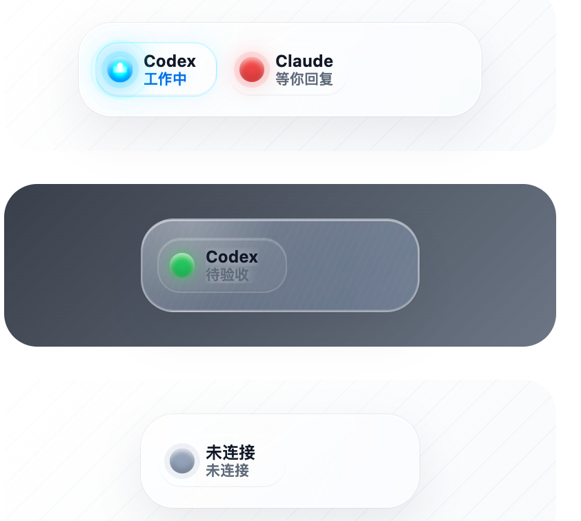

# working-light-agent 使用文档

working-light-agent 是一个 Electron 桌面透明悬浮状态灯，用来显示 Codex 和 Claude 当前状态。



第一阶段已经支持：

- 开发模式启动 Electron 悬浮窗
- DMG 打包安装
- Codex / Claude 进程动态检测
- Codex / Claude hooks 自动更新状态
- CLI 手动控制状态
- 本地状态文件持久化

## 状态说明

| 状态 | 灯色 | 含义 |
| --- | --- | --- |
| `idle` | 灰色暗灯 | 空闲 |
| `working` | 蓝灯 | 正在执行任务 |
| `done` | 绿灯 | 已完成，等待验收 |
| `waiting` | 红灯 | 等待用户回复、确认或授权 |
| `error` | 红灯 | 执行失败或 hook 异常 |

展示列数跟随当前运行中的 CLI 进程：

- 没有检测到 `codex` 或 `claude`：只显示一列“未连接”，状态灯为灰色暗灯
- 只检测到 `codex`：只显示 `Codex`
- 只检测到 `claude`：只显示 `Claude`
- 同时检测到两者：显示 `Codex` 和 `Claude` 两列

hook 或 CLI 写入状态只改变对应 agent 的状态灯，不会让某一列永久显示。

## 界面说明

当前界面按 `prototype-transparent-widget.html` 原型实现为透明玻璃悬浮小组件：

- 透明无边框窗口，默认置顶显示，可拖拽移动
- 单 agent 宽度约 202px，双 agent 宽度约 292px，高度约 68px
- agent 列包含状态灯、agent 名称和中文状态文案
- `working` 使用蓝色 Autopilot 风格呼吸和扩散动效
- `waiting` / `error` 使用红色；`waiting` 默认前 10 秒有脉冲提醒
- `done` 使用绿色，并默认 10 分钟后自动回到 `idle`
- 窗口控制按钮默认隐藏，鼠标悬停或键盘聚焦时显示

原型文件保留在项目根目录：

```text
prototype-transparent-widget.html
```

## 环境要求

- Node.js 22
- pnpm
- macOS 或 Windows

本机临时切到 Node 22：

```bash
export PATH="$HOME/Library/pnpm/nodejs/22.22.0/bin:$PATH"
node -v
```

期望输出类似：

```text
v22.22.0
```

## 安装依赖

```bash
pnpm install
```

如果 Electron 下载失败：

```bash
ELECTRON_MIRROR=https://npmmirror.com/mirrors/electron/ pnpm install
```

如果启动时报 `Electron failed to install correctly`：

```bash
ELECTRON_MIRROR=https://npmmirror.com/mirrors/electron/ pnpm rebuild electron
pnpm exec electron --version
```

## 开发启动

推荐的开发启动命令只有一个：

```bash
pnpm run dev
```

它会依次：

1. 编译 Electron 主进程、preload、CLI 和 shared 模块
2. 启动 Vite renderer dev server
3. 启动 Electron 悬浮窗

正常日志应包含：

```text
[agent-light:dev] main process compiled
[agent-light:dev] Vite ready at http://localhost:5173
[agent-light:dev] launching Electron with VITE_DEV_SERVER_URL=http://localhost:5173
[agent-light:main] Electron app ready
[agent-light:main] creating floating window at ...
[agent-light:main] renderer loaded: http://localhost:5173/
[agent-light:main] floating window shown with bounds ...
```

只看到 Vite URL 不代表 Electron 悬浮窗已经启动。

## 构建和打包

构建代码：

```bash
pnpm run build
```

生成 DMG / zip：

```bash
pnpm run dist
```

产物位置：

```text
release/CodeAgentTrafficLight-0.1.0-arm64.dmg
release/CodeAgentTrafficLight-0.1.0-arm64-mac.zip
```

说明：

- `dist/` 是 TypeScript 和 Vite 编译产物
- `release/` 是 `electron-builder` 安装包产物
- 安装后 hook 脚本位于 app 的 `app.asar.unpacked` 目录中

## 桌面窗口操作

- 双击 agent 列：循环切换状态
- 右键 agent 列：打开状态菜单
- 喇叭按钮：静音 / 取消静音
- 减号按钮：隐藏窗口
- 关闭按钮：关闭窗口
- 托盘菜单：显示窗口、隐藏窗口、静音、退出

空的“未连接”列不可双击切状态，也不可右键打开 agent 菜单。

## CLI 使用

先构建：

```bash
pnpm run build
```

查看状态：

```bash
node dist/cli/agent-light.js status
node dist/cli/agent-light.js status --json
```

设置状态：

```bash
node dist/cli/agent-light.js set codex working
node dist/cli/agent-light.js set codex done
node dist/cli/agent-light.js set codex waiting
node dist/cli/agent-light.js set codex idle

node dist/cli/agent-light.js set claude working
node dist/cli/agent-light.js set claude done
node dist/cli/agent-light.js set claude waiting
node dist/cli/agent-light.js set claude error
```

静音和退出：

```bash
node dist/cli/agent-light.js mute
node dist/cli/agent-light.js unmute
node dist/cli/agent-light.js quit
```

包装命令运行：

```bash
node dist/cli/agent-light-run.js codex npm run build
node dist/cli/agent-light-run.js claude pnpm test
```

`agent-light-run` 会在命令开始时切蓝灯，成功时切绿灯，失败时切红灯。

## Hook 接入

本项目不会自动修改 Codex 或 Claude 配置，只提供示例配置。

示例文件：

```text
examples.codex-installed-config.toml
examples.codex-dev-config.toml
examples.claude-hooks.json
```

Codex 有两个示例是因为路径不同：

- `examples.codex-installed-config.toml`：DMG 安装后使用，路径指向 `/Applications/CodeAgentTrafficLight.app`
- `examples.codex-dev-config.toml`：本仓库开发调试使用，路径指向 `dist/cli/...`

### DMG 安装后的 Codex 配置

先启动桌面应用：

```bash
open /Applications/CodeAgentTrafficLight.app
```

编辑 Codex 全局配置：

```text
~/.codex/config.toml
```

合并 `examples.codex-installed-config.toml` 的内容。核心格式如下：

```toml
[[hooks.UserPromptSubmit]]
[[hooks.UserPromptSubmit.hooks]]
type = "command"
command = "node \"/Applications/CodeAgentTrafficLight.app/Contents/Resources/app.asar.unpacked/dist/cli/agent-light-hook.js\" codex UserPromptSubmit"
timeout = 5
statusMessage = "CodeAgentTrafficLight: Codex working"
```

加完后打开 Codex，执行：

```text
/hooks
```

按提示信任这些 hooks。

### DMG 安装后的 Claude 配置

先启动桌面应用：

```bash
open /Applications/CodeAgentTrafficLight.app
```

编辑 Claude 全局配置：

```text
~/.claude/settings.json
```

合并下面的配置：

```json
{
  "hooks": {
    "UserPromptSubmit": [
      {
        "hooks": [
          {
            "type": "command",
            "command": "node \"/Applications/CodeAgentTrafficLight.app/Contents/Resources/app.asar.unpacked/dist/cli/agent-light-hook.js\" claude UserPromptSubmit"
          }
        ]
      }
    ],
    "PreToolUse": [
      {
        "matcher": "*",
        "hooks": [
          {
            "type": "command",
            "command": "node \"/Applications/CodeAgentTrafficLight.app/Contents/Resources/app.asar.unpacked/dist/cli/agent-light-hook.js\" claude PreToolUse"
          }
        ]
      }
    ],
    "Notification": [
      {
        "hooks": [
          {
            "type": "command",
            "command": "node \"/Applications/CodeAgentTrafficLight.app/Contents/Resources/app.asar.unpacked/dist/cli/agent-light-hook.js\" claude Notification"
          }
        ]
      }
    ],
    "PermissionRequest": [
      {
        "hooks": [
          {
            "type": "command",
            "command": "node \"/Applications/CodeAgentTrafficLight.app/Contents/Resources/app.asar.unpacked/dist/cli/agent-light-hook.js\" claude PermissionRequest"
          }
        ]
      }
    ],
    "Stop": [
      {
        "hooks": [
          {
            "type": "command",
            "command": "node \"/Applications/CodeAgentTrafficLight.app/Contents/Resources/app.asar.unpacked/dist/cli/agent-light-hook.js\" claude Stop"
          }
        ]
      }
    ],
    "StopFailure": [
      {
        "hooks": [
          {
            "type": "command",
            "command": "node \"/Applications/CodeAgentTrafficLight.app/Contents/Resources/app.asar.unpacked/dist/cli/agent-light-hook.js\" claude StopFailure"
          }
        ]
      }
    ],
    "SubagentStop": [
      {
        "hooks": [
          {
            "type": "command",
            "command": "node \"/Applications/CodeAgentTrafficLight.app/Contents/Resources/app.asar.unpacked/dist/cli/agent-light-hook.js\" claude SubagentStop"
          }
        ]
      }
    ]
  }
}
```

Claude hook 映射：

| Hook | 状态 |
| --- | --- |
| `UserPromptSubmit` | `working` |
| `PreToolUse` | `working` |
| `Notification` | `waiting` |
| `PermissionRequest` | `waiting` |
| `Stop` | `done` 或 `waiting` |
| `StopFailure` | `error` |
| `SubagentStop` | `done` |

Claude Code 会通过 `Notification` 和 `PermissionRequest` 更直接地表达等待用户，因此同类场景通常不需要依赖 `Stop` 文本启发式；`Stop` 的等待判断主要用于兜底和兼容。

### 项目内 Claude 配置

本项目已经提供：

```text
.claude/settings.local.json
```

在当前项目里使用 Claude 时，先构建：

```bash
pnpm run build
```

然后启动桌面灯：

```bash
pnpm run dev
```

再在当前项目目录里启动 Claude：

```bash
claude
```

如果要把配置复制到其他项目，建议把命令改成绝对路径，不要继续使用 `${CLAUDE_PROJECT_DIR}`。

## 状态文件位置

macOS：

```text
~/Library/Application Support/CodeAgentTrafficLight/state.json
~/Library/Application Support/CodeAgentTrafficLight/preferences.json
```

Windows：

```text
%APPDATA%\CodeAgentTrafficLight\state.json
%APPDATA%\CodeAgentTrafficLight\preferences.json
```

测试或临时运行时可以指定数据目录：

```bash
AGENT_LIGHT_HOME=/tmp/agent-light node dist/cli/agent-light.js status --json
```

如果本项目对你有帮助，可以给作者微信点个关注，给个小小的鼓励，感谢
